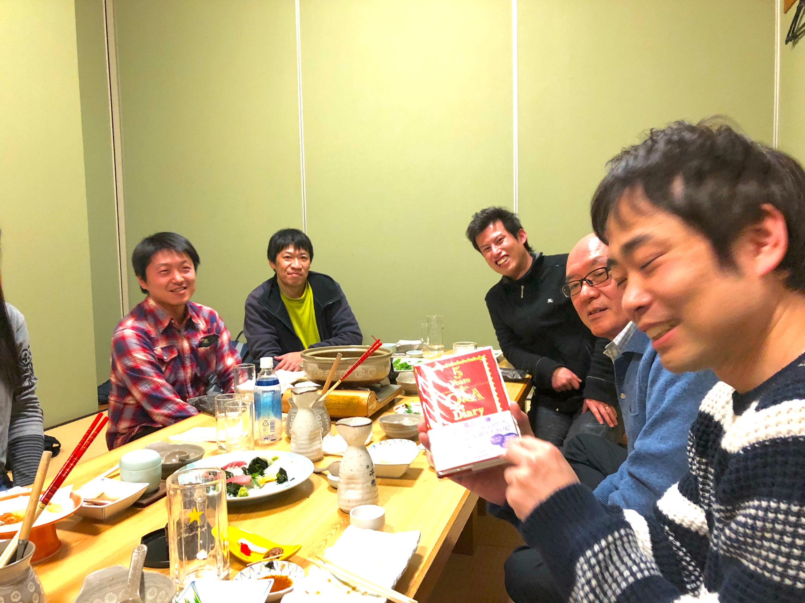

# koguchi
<html lang="ja">
 <head>
  <meta charset="utf-8" />
 

 <link href="https://cdnjs.cloudflare.com/ajax/libs/lightbox2/2.7.1/css/lightbox.css" rel="stylesheet">
   
</head>
<body>
<h1><marquee behavior="alternate">!!! 古口さんつながり、飲み会の記録 !!!</marquee></h1>

2019/03/01、宇都宮駅東口の夜景

                              

<marquee direction="right" scrollamount="20" width="30%">(^_^)/~hada</marquee>

	
<h2><marquee behavior="alternate">!!! 2019年3月1日(金)、新年会_2＠宇都宮駅東口、焼き鳥「でにーろ」 !!!</marquee></h2>

<h3>↓ 画像はクリックで拡大します。閲覧後はほかの部分をクリックしてお戻りください。</h3>
<h3>古口さんより、皆さんにお土産いただきました！・・・すでに何個か食べちゃってますが・・・ </h3>
	

	
	
	
	
	
	
	
		

     
	
<h2><marquee behavior="alternate">!!! 2019年1月18日、新年会＠宇都宮駅東口、韓国焼肉「スンチャン」 !!!</marquee></h2>

<h3>↓ 画像はクリックで拡大します。閲覧後はほかの部分をクリックしてお戻りください。</h3>
<h3>このお酒は美味しかった！ </h3>

	
<h3>・・・病欠宣言・・・ 
今回は年明けの冷え込みに伴い病欠者が多発、最終的に４名の参加となりました。 
以下はライン連絡網の記録 </h3>

     

<h2><marquee behavior="alternate">!!! 2018年7月13日、暑気払い飲み会＠宇都宮駅東口「あん」 !!!</marquee></h2>

<h3>↓ 画像はクリックで拡大します。閲覧後はほかの部分をクリックしてお戻りください。</h3>

  

<h3>・・・開催宣言・・・ 
★★★★★★★★★★★★★★★★★★★★★★★★★★★★★★★★★★★★ 
From: Ryusuke Akita (秋田 隆介) 
Sent: Tuesday, June 12, 2018 1:23 PM 
To: Yasuhiro Toyoda (豊田 泰弘) <yasuhiro_toyoda@n.t.rd.honda.co.jp>; Satoshi Hada (羽田 智) <satoshi_hada@n.t.rd.honda.co.jp>; Humio Ishii (石井 文生) <humio_ishii@n.t.rd.honda.co.jp>; Tetsuya Karita (刈田 哲也) <tetsuya_karita@n.t.rd.honda.co.jp>; HIDETOSHI IMAIZUMI (今泉 秀俊) <Hidetoshi_Imaizumi@hm.honda.co.jp>; Yusuke Sogawa (曽川 祐輔) <Yusuke_Sogawa@n.t.rd.honda.co.jp>; Ken Hayasaka (早坂 健) <ken_hayasaka@n.t.rd.honda.co.jp>; Jingxun Li (李 京勲) <jingxun_li@n.t.rd.honda.co.jp> 
Subject: 暑気払いのお誘い 
 
 
みなさま 
 
お世話になります。1G1 秋田(8772072)です。 
 
早速ですが標記の件、 
7月の下記日程のどこかで飲み会しませんか？というお誘いです。 
 
つきましては、参加可否を埋めて今週いっぱいをめどに返信お願いします。 
ちなみにお店は中華かなと思っています。 
 
　 	7/13(金) 	7/20(金) 	7/27(金) 
 豊田さん  	　 	　
 羽田さん 　 	　
 石井さん 	　 	　
 刈田さん 	　 	　
 今泉さん  	　 	　
 曽川さん  	　 	　
 早坂さん  	　 	　
 李さん 	　 	　
 古口さん 	? 	? 	?
 秋田 	○ 	○ 	○
 
 以上、よろしくお願いいたします。 
★★★★★★★★★★★★★★★★★★★★★★★★★★★★★★★★★★★★ </h3>
	

     	
<h2><marquee behavior="alternate">!!! 2018年2月2日、桑原さん中国北京駐在、壮行会 !!!</marquee></h2>

<h3>↓ 画像はクリックで拡大します。閲覧後はほかの部分をクリックしてお戻りください。</h3>

  
                                  	

  </body>

</html>
  

<!-- フッタ -->
 <footer>
 Copyright 2018/07/14 S.Hada
 </footer>
